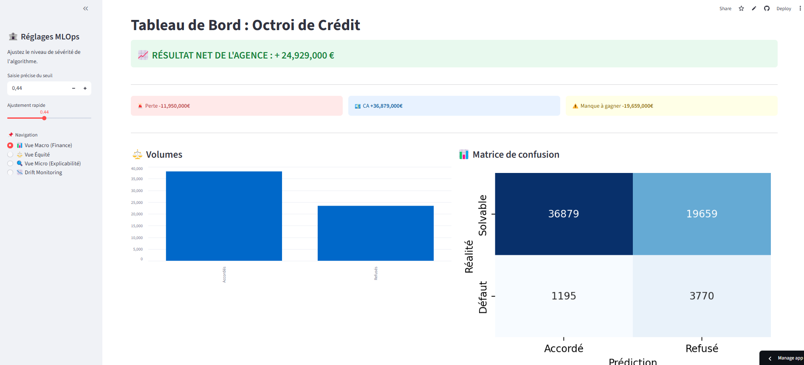
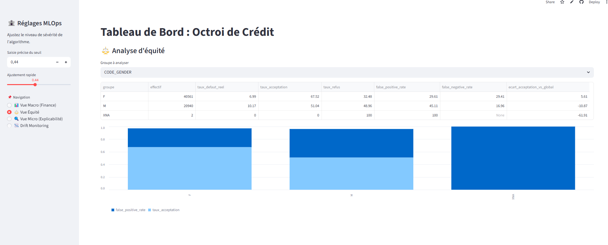
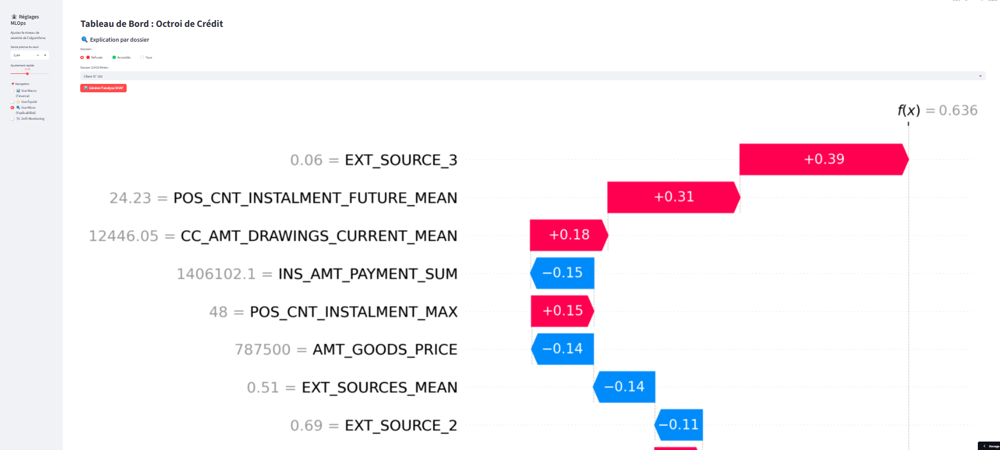

# 💳 Zero-Defect Credit Risk Pipeline


---

## 🌟 Overview

This project implements an **end-to-end MLOps pipeline** for credit risk scoring.

The **“Zero-Defect” approach** goes beyond prediction:
it ensures **data reliability, model robustness, and continuous monitoring** across the entire lifecycle — from raw data ingestion to production deployment.

👉 **Live Dashboard**
https://zero-defect-credit-risk-pipeline-fxqrngtu5bmqpctnghwnqn.streamlit.app/

---

## 🛡️ The 4 "Zero-Defect" Pillars

| Pillar                          | Technology                 | Business Impact                           |
| ------------------------------- | -------------------------- | ----------------------------------------- |
| **Data Quality Validation**     | Pandera + YAML             | Ensures data integrity before modeling    |
| **Cost Optimization**           | XGBoost (threshold tuning) | Minimizes real financial loss (FN > FP)   |
| **Interpretability**            | SHAP                       | Explains model decisions for compliance   |
| **Fairness & Drift Monitoring** | Fairlearn + Evidently      | Detects bias and data drift in production |

---

## 🏗️ Project Architecture

* **`app.py`** → Interactive Streamlit dashboard
* **`notebooks/`** → End-to-end pipeline (QC → Feature Engineering → Modeling → Monitoring)
* **`configs/`** → Data contracts (YAML) and validation schemas (Pandera)
* **`models/`** → Trained model (`xgboost_baseline.pkl`)
* **`data/processed/`** → Optimized datasets for fast inference
* **`drift/`** → Data drift monitoring reports (Evidently)
* **`Dockerfile`** → Containerized deployment

---

## 🧠 Machine Learning Approach

* Binary classification: **Default vs Non-default**
* Strong **class imbalance (~8%)**
* Business-driven optimization:

  * False Negative cost = **10× higher than False Positive**
* Model comparison:

  * XGBoost vs LightGBM
  * Similar performance → feature engineering is the limiting factor

📊 Final performance:

* ROC-AUC ≈ **0.78**
* Business cost optimized via threshold tuning

---

## ⚙️ Tech Stack

**Data Science**

* Pandas, NumPy, Scikit-learn
* XGBoost, LightGBM

**Explainability**

* SHAP

**Monitoring**

* Evidently AI (Data Drift)
* Fairlearn (Bias detection)

**MLOps & Deployment**

* Docker
* Streamlit Cloud
* Poetry

---

## 🚀 Installation & Usage

### 1. Clone the repository

```bash
git clone https://github.com/alouiyaz78/Zero-defect-credit-risk-pipeline.git
cd Zero-defect-credit-risk-pipeline
```

---

### 2. Run with Docker (Recommended)

```bash
# Build the image
docker build -t credit-scoring-app .

# Run the container
docker run -p 8501:8501 credit-scoring-app
```

👉 App available at: http://localhost:8501

---

### 3. Manual installation (Poetry)

```bash
# Install dependencies
poetry install

# Run the Streamlit app
poetry run streamlit run app.py
```

---

## 📊 Dashboard Preview





---

## 📈 Key Features

* ✔️ End-to-end ML pipeline
* ✔️ Data validation with Pandera & YAML
* ✔️ Business-oriented cost optimization
* ✔️ Model interpretability (SHAP)
* ✔️ Fairness analysis (age, gender)
* ✔️ Drift detection (Evidently)
* ✔️ Production-ready deployment (Docker + Streamlit)

---

## 👥 Team

* Yazid Aloui
* Malik
* Radouane

---

## 🏁 Conclusion

This project demonstrates a **production-ready credit risk system** combining:

* Data Engineering
* Machine Learning
* Model Governance
* MLOps best practices

It highlights that **data quality and feature engineering** are often more impactful than model selection alone.

---

## 📌 Future Improvements

* Advanced feature engineering (temporal aggregations)
* Threshold optimization via automated search
* Real-time monitoring pipeline
* Model retraining automation

---
